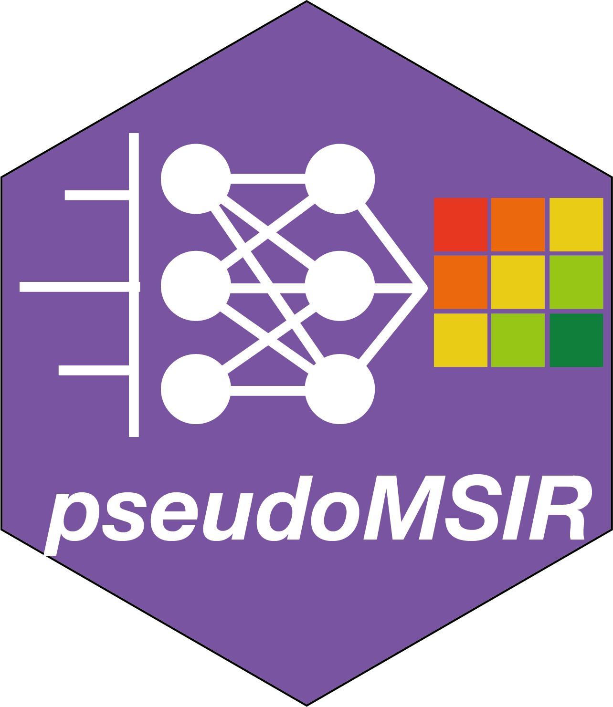

<!-- README.md is generated from README.Rmd. Please edit that file -->

# pseudomsir 

[](https://cran.r-project.org/package=pseudomsir)
[](https://github.com/tidymass/pseudomsir)
[](https://cran.r-project.org/package=pseudomsir)
[](https://www.tidyverse.org/lifecycle/#experimental)

`pseudomsir` is a part of [deepPseudoMSI project](https://www.deeppseudomsi.org/).


# **About**

`pseudomsir` is a R package which is used for [deepPseudoMSI project](https://www.deeppseudomsi.org/).


# **Installation**

You can install `pseudomsir` from [GitLab](https://gitlab.com/jaspershen/pseudomsir)

``` r
if(!require(remotes)){
install.packages("remotes")
}
remotes::install_gitlab("jaspershen/pseudomsir")
```

or [GitHub](https://github.com/deepPseudoMSI-project/pseudomsir)

``` r
remotes::install_github("deepPseudoMSI-project/pseudomsir")
```

# **Usage**

Please see the `Get started` page to get the instruction of `pseudomsir`.


# **Need help?**

If you have any quesitions about `pseudomsir`, please don’t hesitate to
email me (<shenxt@stanford.edu>).

<i class="fa fa-weixin"></i>
[shenzutao1990](https://www.shenxt.info/files/wechat_QR.jpg)

<i class="fa fa-envelope"></i> <shenxt@stanford.edu>

<i class="fa fa-twitter"></i>
[Twitter](https://twitter.com/JasperShen1990)

<i class="fa fa-map-marker-alt"></i> [M339, Alway building, Cooper Lane,
Palo Alto,
CA 94304](https://www.google.com/maps/place/Alway+Building/@37.4322345,-122.1770883,17z/data=!3m1!4b1!4m5!3m4!1s0x808fa4d335c3be37:0x9057931f3b312c29!8m2!3d37.4322345!4d-122.1748996)

# **Citation**

If you use `pseudomsir` in your publications, please cite this paper:

Deep Learning-based Pseudo-Mass Spectrometry Imaging Analysis for Precision Medicine.

Xiaotao Shen, Wei Shao, Chuchu Wang, Liang Liang, Songjie Chen, Sai Zhang, Mirabela Rusu, Michael P. Snyder.

[Web Link](https://www.biorxiv.org/content/10.1101/2022.04.29.490098v1.abstract).

Thanks very much!
